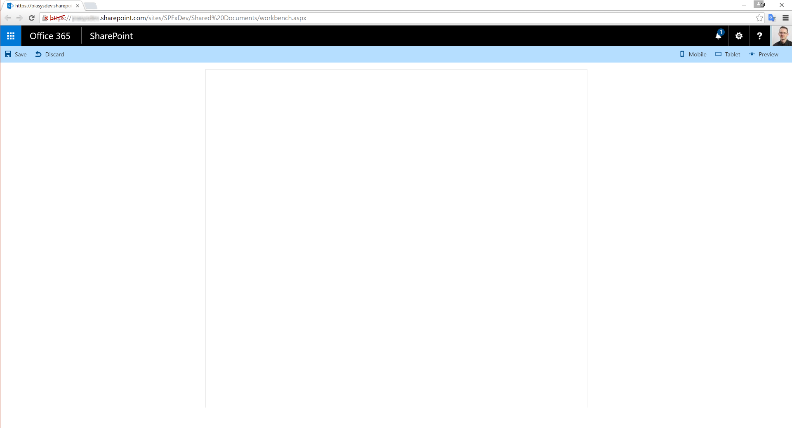

# SharePoint Framework Developer Site
This templates provides a ready to go solution for creating a Developer Site Collection in SharePoint Online, with all the required settings for running Client Web Parts based on the new SharePoint Framework. It is based on the requirements highlighted in the following article: [Set up your Office 365 developer tenant](http://dev.office.com/sharepoint/docs/spfx/set-up-your-developer-tenant).

Of course, you will have to create the Microsoft Office 365 developer tenant manually, and after that you will be able to replace the instructions described from paragraph "Create a new Developer Site collection" to the end of the "Set up your Office 365 developer tenant" article, simply by using this template.

These are the main artifacts/settings provisioned by the template:
- Creates a Developer Site (DEV#0), if the template is used within the PnP Partner Pack v. 2.0
- Adds the *ClientSideApplicationId* column to the "Shared Documents" library of the target site
- Uploads the *workbench.aspx" file into the "Shared Documents" library of the target site

Enjoy the new SharePoint Framework!