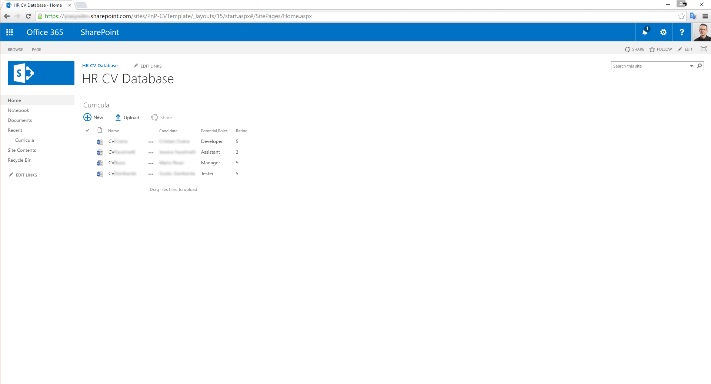

# Curriculum Vitae Database
This templates provides the basic functionalities for handling an HR database of Curriculum Vitae.
The template provides a library for storing CVs with the following custom fields:
- CV File Name
- Candidate Name
- Potential Role (based on a taxonomy field)
- Rating

Here you can see a screenshot of the home page:

